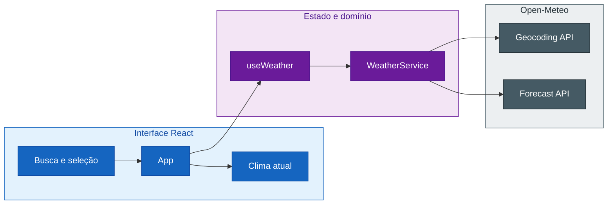

## Step 1: Intenção — Execute a baseline e registre a intenção

> Você não recebeu um repositório vazio. Antes de aceitar uma mudança, prove o
> que já funciona e localize os contratos que descrevem esse comportamento.


Uma pessoa usuária pediu a previsão dos próximos 7 dias. A reação mais rápida
seria abrir o componente e começar a programar. Neste exercício, você fará algo
mais importante primeiro: entender o produto que já existe.

### O projeto que você está evoluindo

O Weather App é uma aplicação web em React e TypeScript que usa a Open-Meteo,
sem API key. A pessoa usuária busca uma cidade, escolhe uma localização e recebe
o clima atual com temperatura, sensação térmica, condição WMO, vento e umidade.

O produto já possui uma arquitetura pequena, mas completa:



A baseline inclui interface acessível, serviço externo isolado, estados de
carregamento e erro, testes unitários e de componente, além de um E2E com APIs
interceptadas. O exercício não é construir outro app: é evoluir esse sistema
para apresentar também a previsão diária dos próximos 7 dias.

### Os artefatos do exercício

| Artefato | Responsabilidade |
|---|---|
| `constitution.md` | Define princípios permanentes e a ordem de evolução |
| `intentions/*.md` | Registra a intenção recebida antes da evolução da especificação |
| `feedback/*.md` | Registra resultados observados durante a validação |
| `specs/weather-app-spec.md` | Define comportamentos e critérios de aceite |
| `plans/weather-app-plan.md` | Registra impacto, decisões e estratégia de testes |
| `tasks/weather-app-tasks.md` | Fatia o plano em trabalho dependente e verificável |
| Código e testes | Implementam o comportamento e fornecem evidência |

A **Constituição** é estável e governa todas as mudanças. Neste step,
`intentions/7-day-forecast.md` registra a intenção que inicia o SDD e compõe o
feedforward antes da execução. No Step 8, `feedback/7-day-forecast-loop.md`
preservará resultados observados e eventuais decisões de replanejamento. Nenhum
deles substitui a especificação: entram no SDD em momentos diferentes.

### 📖 Teoria: mudanças começam pelo estado atual

SDD não significa criar documentos do zero para cada pedido. Em um produto vivo,
a primeira tarefa é ancorar-se no estado atual: especificação, planejamento, tarefas, código e
testes precisam contar a mesma história.

Essa leitura inicial evita dois erros comuns:

- implementar novamente algo que a baseline já resolve;
- tomar uma decisão técnica antes de esclarecer o resultado esperado.

> [!NOTE]
> A branch `main` é o nosso **antes**. Ela contém F1–F4: busca de cidade, clima
> atual, conversão de temperatura e condições climáticas WMO. Ao final, o diff
> da branch `feature/7-day-forecast` mostrará apenas a evolução necessária para
> F5: previsão diária dos próximos 7 dias.

### Objetivo

| Evidência | Por que existe |
|---|---|
| `constitution.md` | Explicita as regras que nenhum incremento pode contornar |
| App aberto no navegador | Torna visível o estado **antes** da evolução |
| Baseline verde | Confirma que uma falha futura foi introduzida pelo incremento |
| `intentions/7-day-forecast.md` | Explicita o resultado desejado sem prescrever solução |
| Branch `feature/7-day-forecast` | Mantém visível o antes e depois da mudança |

### Pedido recebido

> “Além do clima atual, preciso enxergar os próximos 7 dias para planejar minha
> semana. Para cada dia, quero condição climática, máxima e mínima.”

Ainda não transforme isso em solução. Primeiro investigue o pedido contra a
baseline, valide as evidências e só então registre o problema e o resultado
esperado sem decidir componentes, tipos ou parâmetros de API.

> [!IMPORTANT]
> Este não é um fluxo de vibe coding. A intenção é fornecida pelo exercício e
> copiada sem geração por LLM. O trabalho começa por compreender essa entrada e
> confrontá-la com a baseline; a IA só será usada depois, sob artefatos e limites
> explícitos.

### ⌨️ Atividade: inspecione antes de propor

1. Crie a branch usada durante todo o exercício:

   ```bash
   git checkout -b feature/7-day-forecast
   ```

2. Instale as dependências:

   ```bash
   pnpm install
   pnpm exec playwright install --with-deps chromium
   ```

   O segundo comando instala o navegador usado pelo teste E2E. Ele é necessário
   apenas na primeira execução ou quando o cache do Playwright for removido.

3. Suba o Weather App para conhecer visualmente o **antes**:

   ```bash
   pnpm dev
   ```

   O Vite usa por padrão a porta `5173` e mostra no terminal uma saída parecida
   com esta:

   ```text
   Local: http://localhost:5173/
   ```

   Abra a URL exibida no terminal. Se a porta `5173` já estiver ocupada, o Vite
   selecionará outra, como `5174`; use sempre o endereço que ele informar.

   > [!TIP]
   > O comando mantém o servidor em execução. Abra um segundo terminal para
   > continuar o exercício ou pressione `Ctrl+C` depois da inspeção. Em um
   > Codespace, abra a URL encaminhada pela notificação ou pela aba **Ports**.

   No navegador, confirme o estado atual do produto:

   - busque uma cidade;
   - selecione um resultado;
   - confira temperatura, sensação térmica, condição, vento e umidade;
   - observe que ainda não existe uma seção com os próximos 7 dias.

4. Com o servidor encerrado ou em outro terminal, execute a baseline automatizada:

   ```bash
   pnpm lint
   pnpm build
   pnpm test
   pnpm test:e2e
   ```

5. Leia, nesta ordem:
   - `constitution.md`
   - `specs/weather-app-spec.md`
   - `plans/weather-app-plan.md`
   - `tasks/weather-app-tasks.md`
   - `src/types/weather.ts`
   - `src/services/weather.ts`
   - `src/components/WeatherCard.tsx`

6. No Explorer do VS Code, crie manualmente a pasta `intentions`. Dentro dela,
    crie o arquivo `7-day-forecast.md` e copie todo o conteúdo abaixo:

    ```markdown
    # Intenção: planejamento semanal com previsão do tempo

    ## Intenção

    Evoluir o Weather App para ajudar uma pessoa a planejar os próximos dias
    depois de escolher uma cidade, preservando a consulta de clima atual que já
    existe.

    ## Valor esperado

    A pessoa usuária consegue tomar decisões para a semana sem repetir buscas ou
    consultar outra aplicação para conhecer a tendência do tempo.

    ## Resultados desejados

    - Depois de buscar e selecionar uma cidade, a pessoa usuária continua vendo
       o clima atual.
    - A mesma experiência apresenta a previsão dos próximos 7 dias para a cidade
       selecionada.
    - Cada dia apresenta a condição climática e as temperaturas máxima e mínima.

    ## Restrições

    - A intenção descreve resultados observáveis, não componentes, tipos,
       endpoints ou parâmetros de API.
    - O comportamento atual deve ser preservado durante a evolução.
    - Previsão horária, cidades favoritas e notificações não fazem parte deste
       pedido.

    ## Dúvidas

    - Como a seção de previsão será identificada de forma acessível?
    - Como datas e unidades serão apresentadas de modo consistente com o produto
       atual?
    ```

    Não use o terminal nem delegue essa criação ao Copilot. O conteúdo visível no
    lesson é a entrada canônica do hands-on; o copy/paste mantém essa entrada
    igual para todas as pessoas.

7. Leia `intentions/7-day-forecast.md` e compare-o manualmente com a baseline:

   - o clima atual já atende toda a intenção ou existe um delta observável?
   - quais resultados foram pedidos explicitamente?
   - quais decisões técnicas ainda não foram tomadas?
   - quais dúvidas devem permanecer abertas para a especificação ou o planejamento?

   Não complemente o arquivo com uma solução. A intenção registra **POR QUE** e
   **qual resultado** é desejado; a especificação transformará isso em comportamento
   verificável no Step 2.

8. Revise o arquivo copiado. Ele deve explicar o valor para a pessoa usuária sem
   prescrever JSX, interfaces ou uma implementação final.

   Pergunte a si mesmo:

   - O texto descreve **POR QUE** sete dias são úteis?
   - As restrições vieram do pedido ou foram inventadas durante a análise?
   - As dúvidas ainda abertas estão visíveis?
   - O impacto aponta para arquivos que realmente existem?

9. Valide a intenção:

   ```bash
   pnpm validate:sdd intent
   ```

10. Faça commit e push:

   ```bash
   git add intentions/7-day-forecast.md
   git commit -m "step 1: record seven-day forecast intent"
   git push -u origin feature/7-day-forecast
   ```

> [!IMPORTANT]
> O workflow valida a estrutura e o escopo da intenção e executa a baseline.
> Neste step, a entrada deve permanecer como fornecida; interpretação e
> refinamento começam na especificação. Alterar especificação ou código agora quebra a ordem do
> exercício.

### Checkpoint

- [ ] O app foi aberto e o estado **antes** foi inspecionado no navegador.
- [ ] A Constituição foi lida e seus princípios orientam a análise.
- [ ] A baseline está verde.
- [ ] A intenção explica o resultado desejado sem depender do histórico do chat.
- [ ] A intenção foi comparada manualmente com a baseline.
- [ ] Nenhum artefato posterior à intenção foi alterado ainda.

O workflow valida estrutura e baseline, não um texto pronto.

### Em outras ferramentas

| Ferramenta | Como representa esta etapa |
|---|---|
| **spec-kit** | Constituição e contexto existente orientam a clarificação inicial |
| **OpenSpec** | Uma proposta registra a mudança antes dos deltas de spec |
| **BMAD-METHOD** | O contexto inicial organiza necessidade, valor e restrições |

<details>
<summary>Having trouble? 🤷</summary><br/>

- **A branch já existe**: use `git switch feature/7-day-forecast` e continue nela.
- **A porta `5173` está ocupada**: não encerre outro processo sem necessidade;
   abra a URL alternativa exibida pelo Vite.
- **A página não abre em um Codespace**: confira se a porta do Vite aparece na
   aba **Ports** e abra o endereço encaminhado por ela.
- **O terminal parece travado após `pnpm dev`**: esse é o comportamento esperado
   de um servidor. Use outro terminal ou pressione `Ctrl+C` para encerrá-lo.
- **A baseline não está verde**: não avance. Registre o comando e a mensagem de
   erro; primeiro confirme se dependências e navegador do Playwright estão
   instalados.
- **A pasta ou o arquivo não aparece no Explorer**: confirme que você criou
   `intentions/7-day-forecast.md` na raiz do repositório, não dentro de `.github`.
- **O workflow não iniciou**: confirme que a branch atual não é `main` e que
   `intentions/7-day-forecast.md` está no commit. O gatilho aceita qualquer
   branch diferente de `main`; `feature/7-day-forecast` é a branch adotada para
   manter o exercício e o PR consistentes.

</details>