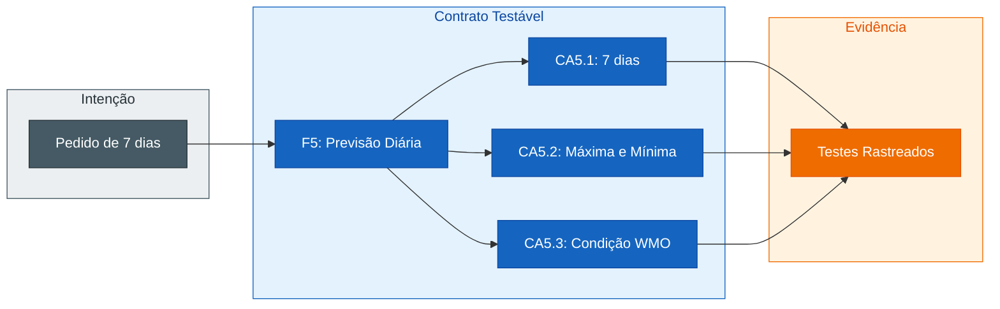

## Step 2: Especificação — Evolua a especificação com F5, a previsão de 7 dias

> O pedido muda o comportamento observável. Portanto, a especificação viva precisa mudar
> antes do plano e do código.

No step anterior, você registrou a necessidade sem escolher uma solução. Agora
essa intenção precisa virar uma promessa testável do produto.

### 📖 Teoria: uma spec viva preserva sua história

Uma evolução não apaga a história. F1–F4 — busca de cidade, clima atual,
conversão de temperatura e condições WMO — continuam válidas. A previsão diária
dos próximos 7 dias recebe o identificador **F5** e novos critérios de aceite (CA). O diff da especificação passa a
mostrar o que o produto prometia antes e o que promete agora.

IDs estáveis funcionam como pontos de ancoragem. `CA5.1`, que representa exibir
exatamente 7 dias para a cidade selecionada, pode aparecer no planejamento, em uma tarefa,
no nome de um teste e na revisão sem depender da redação exata da especificação. Essa
cadeia torna a intenção rastreável.



> [!TIP]
> Um bom critério descreve algo que uma pessoa ou um teste consegue observar.
> Nomes de componentes, propriedades TypeScript e parâmetros de API pertencem ao
> Plan, não à especificação.

### Objetivo

| Artefato | Por que existe |
|---|---|
| `specs/weather-app-spec.md` | Preserva F1–F4 (busca, clima atual, temperatura e WMO) e acrescenta F5 (previsão de 7 dias) |
| F5 e CA5.1–CA5.3 | Ancoram 7 dias exibidos, máxima e mínima e condição WMO por dia |
| Histórico da Especificação | Explica quando e por que o contrato mudou |

### Invariantes do pedido

Sua redação pode variar, mas a spec precisa tornar verificável que:

- uma cidade selecionada apresenta exatamente 7 dias;
- cada dia apresenta temperatura máxima e mínima;
- cada dia apresenta a condição climática;
- a seção possui um contrato observável acessível;
- previsão horária continua fora de escopo.

Esses comportamentos serão ancorados assim:

- **CA5.1**: exibir exatamente 7 dias para a cidade selecionada;
- **CA5.2**: exibir temperatura máxima e mínima em cada dia;
- **CA5.3**: exibir a condição climática WMO de cada dia.

### ⌨️ Atividade: transforme o pedido em comportamento verificável

1. Releia `intentions/7-day-forecast.md` antes de abrir a spec. Use-o para
   confirmar o valor, os resultados desejados, as restrições e as dúvidas que a
   especificação precisa resolver. A intenção é o feedforward do pedido; ela não
   é reescrita neste step.

2. Abra `specs/weather-app-spec.md` no VS Code e substitua seu conteúdo pelo
   Markdown abaixo. Ele preserva F1–F4 e acrescenta somente o contrato de F5:

   ```markdown
   # Especificação: Weather App

   ## Estado da spec

   - **Versão:** 1.1
   - **Baseline:** busca de cidade e clima atual
   - **Última decisão:** acrescentar previsão diária de 7 dias; previsão horária permanece fora de escopo

   ## Escopo

   Aplicação web estática para buscar cidades, consultar o clima atual e a
   previsão diária dos próximos 7 dias usando a Open-Meteo, sem autenticação.

   ## Fora de escopo

   - Previsão horária.
   - Geolocalização automática.
   - Histórico persistido e cidades favoritas.
   - Notificações e múltiplos idiomas.

   ## Funcionalidades e Critérios de Aceite

   ### F1: Busca de cidade

   - **CA1.1:** DADO que o campo está vazio, ENTÃO o botão "Buscar" permanece desabilitado.
   - **CA1.2:** DADO um nome válido, QUANDO buscar, ENTÃO até cinco localizações são apresentadas para seleção.
   - **CA1.3:** DADO que nenhuma localização foi encontrada, ENTÃO a mensagem "Nenhuma cidade encontrada." é apresentada.
   - **CA1.4:** DADO uma falha de geocodificação, ENTÃO uma mensagem de erro é apresentada.

   ### F2: Clima atual

   - **CA2.1:** DADO uma localização selecionada, ENTÃO a temperatura atual em Celsius é apresentada.
   - **CA2.2:** DADO uma localização selecionada, ENTÃO a sensação térmica é apresentada.
   - **CA2.3:** DADO uma localização selecionada, ENTÃO a condição climática possui descrição e representação visual.
   - **CA2.4:** DADO uma localização selecionada, ENTÃO vento em km/h e umidade em percentual são apresentados.
   - **CA2.5:** DADO uma consulta em andamento, ENTÃO um estado de carregamento é apresentado.
   - **CA2.6:** DADO uma falha na consulta do clima, ENTÃO uma mensagem de erro é apresentada.

   ### F3: Conversão de temperatura

   - **CA3.1:** A conversão segue $F = (C \times 9/5) + 32$.
   - **CA3.2:** 0°C corresponde a 32°F.
   - **CA3.3:** 100°C corresponde a 212°F.
   - **CA3.4:** -40°C corresponde a -40°F.

   ### F4: Condições WMO

   - **CA4.1:** O código WMO 0 representa "Céu limpo".
   - **CA4.2:** O código WMO 95 representa "Tempestade".
   - **CA4.3:** Um código desconhecido representa "Condição desconhecida".

   ### F5: Previsão diária de 7 dias

   - **CA5.1:** DADO uma localização selecionada, QUANDO o clima for carregado, ENTÃO exatamente 7 dias de previsão são apresentados.
   - **CA5.2:** DADO um dia da previsão, QUANDO ele for apresentado, ENTÃO suas temperaturas máxima e mínima são exibidas em Celsius.
   - **CA5.3:** DADO um dia da previsão, QUANDO ele for apresentado, ENTÃO sua condição climática WMO possui descrição e representação visual.

   ## Contrato observável

   - Campo de busca: `searchbox` com nome acessível "Nome da cidade".
   - Ação de busca: botão "Buscar", desabilitado quando o campo está vazio.
   - Resultado: botão com nome acessível "Selecionar {cidade}, {país}".
   - Clima atual: região com nome acessível "Clima atual para {cidade}".
   - Previsão diária: região com nome acessível "Previsão de 7 dias para {cidade}", contendo exatamente sete entradas.
   - Erros: elementos com `role="alert"`.

   ## Histórico

   | Versão | Mudança | Critérios |
   |---|---|---|
   | 1.0 | Baseline de busca e clima atual | CA1.1–CA4.3 |
   | 1.1 | Previsão diária dos próximos 7 dias | CA5.1–CA5.3 |
   ```

   Não delegue essa edição ao Copilot. O conteúdo fornecido é o delta canônico
   usado por todas as pessoas no hands-on.

3. Revise criticamente:
   - Cada `ENTÃO` pode ser observado por um teste?
   - “7 dias” significa exatamente sete entradas?
   - Máxima, mínima e condição são verificáveis por entrada?
   - A spec evita decisões como nome de componente ou estrutura TypeScript?

   Leia o diff isoladamente. Uma pessoa que não conhece a implementação deveria
   entender o novo comportamento e distinguir claramente o que continua fora de
   escopo.

4. Rode o validador de âncoras:

   ```bash
   pnpm validate:sdd spec
   ```

5. Commit e push:

   ```bash
   git add specs/weather-app-spec.md
   git commit -m "step 2: add seven-day forecast to live spec"
   git push
   ```

> [!IMPORTANT]
> O arquivo já existia na baseline. Para avançar, o workflow exige um **delta**
> em relação a `main`, preservação dos IDs anteriores e as novas âncoras de F5,
> a previsão diária de 7 dias.

### Checkpoint

- [ ] F1–F4 (busca, clima atual, temperatura e WMO) e seus CAs foram preservados.
- [ ] F5 (previsão de 7 dias) contém CA5.1 (7 dias), CA5.2 (máxima e mínima) e CA5.3 (condição WMO).
- [ ] Contrato observável e histórico foram atualizados.
- [ ] Somente a spec mudou neste step.

O workflow compara sua branch com `main`; a existência do arquivo baseline não é
suficiente para avançar.

### Em outras ferramentas

| Ferramenta | Como trata uma evolução de spec |
|---|---|
| **spec-kit** | A especificação é refinada antes da geração do plano |
| **OpenSpec** | Deltas `ADDED`, `MODIFIED` e `REMOVED` tornam a mudança explícita |
| **BMAD-METHOD** | Requisitos e critérios são refinados mantendo rastreabilidade |

<details>
<summary>Having trouble? 🤷</summary><br/>

- **`âncora ausente: F5`**: confirme que a funcionalidade de previsão diária de
   7 dias está identificada como F5 na spec, e não apenas na intenção ou
   histórico.
- **Um CA descreve a implementação**: reescreva o resultado em termos de
   comportamento observável e mova a decisão técnica para o próximo step.
- **O diff mostra F1–F4 removidos ou renumerados**: restaure os IDs de busca,
   clima atual, conversão de temperatura e condições WMO; novos comportamentos
   recebem novos IDs.
- **O workflow não iniciou**: confirme que a branch atual não é `main` e que o
   commit altera `specs/weather-app-spec.md`. O gatilho é definido por esse
   caminho; continue em `feature/7-day-forecast` para preservar o fluxo até o PR.

</details>