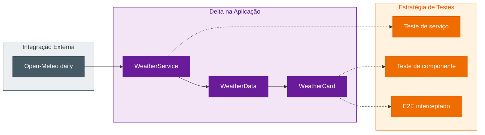

## Step 3: Planejamento — Analise o impacto em dados, API, UI e testes

> A especificação agora diz o que mudou. O planejamento decide como encaixar essa mudança no
> sistema existente sem apagar decisões anteriores.


Na nova funcionalidade (F5), a previsão diária dos próximos 7 dias, parece pequena na interface, mas seus
dados atravessam várias camadas. Este é o momento de tornar esse impacto
explícito antes que decisões apareçam por acaso no código.

### 📖 Teoria: planejar é conectar intenção e arquitetura

O planejamento de uma evolução começa por impacto, não por uma arquitetura nova.
Dados diários atravessam o contrato da API, o modelo, a apresentação e a
estratégia de testes. Essa cadeia precisa ser explícita antes do código.



O planejamento deve registrar decisões e alternativas, mas não congelar detalhes que o
código pode resolver com segurança. Ele responde **COMO** e **onde**, enquanto a
especificação continua respondendo **O QUE** e **por que**.

### Objetivo

| Artefato | Por que existe |
|---|---|
| `plans/weather-app-plan.md` | Registra o impacto técnico de F5, a previsão de 7 dias, sobre a baseline |
| Mapeamento CA → Teste | Define antecipadamente como cada promessa será provada |
| Alternativas e Decisões | Torna escolhas técnicas revisáveis, não implícitas |

### ⌨️ Atividade: planeje o menor delta coerente

1. Releia `intentions/7-day-forecast.md` e a spec de F5 antes de decidir o
   impacto técnico. Confirme que o plano preserva o valor do pedido — planejar a
   semana após selecionar uma cidade — sem transformar as dúvidas da intenção em
   requisitos inventados.

2. Abra `plans/weather-app-plan.md`. No primeiro parágrafo, troque "versão 1.0"
   por "versão 1.1". Depois, cole o delta abaixo no final do arquivo:

   ```markdown
   ## Delta F5: previsão diária de 7 dias

   ### Análise de impacto

   | Superfície | Impacto mínimo |
   |---|---|
   | `WeatherData` | Acrescentar `daily` com arrays de data, máxima, mínima e código WMO |
   | Open-Meteo Forecast | Solicitar `daily=temperature_2m_max,temperature_2m_min,weather_code`, `timezone=auto` e `forecast_days=7` |
   | `WeatherCard` | Preservar a região de clima atual e acrescentar uma região acessível com sete entradas diárias |
   | Testes | Usar fixtures com valores distintos e provar serviço, componente e jornada E2E |

   Os arrays de `daily` são relacionados pelo mesmo índice: `time[i]`,
   `temperature_2m_max[i]`, `temperature_2m_min[i]` e `weather_code[i]`
   representam o mesmo dia.

   ### Decisões do delta

   | Decisão | Escolha | Alternativa descartada | Motivo |
   |---|---|---|---|
   | Modelo Diário | Estender `WeatherData` com os arrays retornados pela API | Criar uma segunda árvore de estado | Mantém clima atual e previsão na mesma resposta |
   | Período | `forecast_days=7` | Cortar um retorno maior na UI | O contrato é aplicado na fronteira externa |
   | Campos | Solicitar apenas máxima, mínima e `weather_code` | Solicitar todos os campos diários | Evita dados sem requisito |
   | Apresentação | Estender `WeatherCard` | Criar outro fluxo de seleção | Preserva a jornada existente |

   ### Estratégia de testes do delta

   | Critério | Serviço | Componente | E2E |
   |---|---|---|---|
   | CA5.1 | Prova `forecast_days=7` e sete datas retornadas | Prova exatamente sete entradas | Prova sete entradas após busca e seleção |
   | CA5.2 | Prova os arrays `temperature_2m_max` e `temperature_2m_min` | Prova máxima e mínima associadas a cada dia | Prova máxima e mínima na jornada |
   | CA5.3 | Prova o array `weather_code` | Prova descrição e representação WMO por dia | Prova a condição na jornada |

   A cobertura de F2 permanece nos testes existentes de serviço, componente e
   E2E para detectar regressão do clima atual.
   ```

   Não delegue essa edição ao Copilot. Esse delta é a decisão técnica canônica
   para o restante do hands-on.

3. Revise a proposta:
   - O modelo representa tempo, máxima, mínima e código WMO por dia?
   - A API solicita apenas os campos necessários?
   - O plano descreve a extensão do card, não sua marcação exata?
   - Cada CA5 — 7 dias, máxima/mínima e condição WMO — possui evidência planejada?
   - Regressões da F2, a apresentação do clima atual, continuam cobertas?

   Procure também sinais de excesso: uma nova biblioteca, uma segunda fonte de
   dados ou uma arquitetura paralela precisam de justificativa forte para uma
   evolução deste tamanho.

4. Valide:

   ```bash
   pnpm validate:sdd plan
   ```

5. Commit e push:

   ```bash
   git add plans/weather-app-plan.md
   git commit -m "step 3: plan seven-day forecast impact"
   git push
   ```

> [!NOTE]
> Este step edita apenas o planejamento e não implementa o produto. Essa
> separação será importante novamente no loop do Step 8.

### Checkpoint

- [ ] O plano mudou em relação a `main`.
- [ ] Dados, API, UI e testes aparecem na análise de impacto.
- [ ] CA5.1 (7 dias), CA5.2 (máxima/mínima) e CA5.3 (condição WMO) estão mapeados a evidências.
- [ ] Nenhum código foi implementado.

### Em outras ferramentas

| Ferramenta | Como representa o planejamento |
|---|---|
| **spec-kit** | O comando de plan transforma requisitos em contexto técnico |
| **OpenSpec** | Design e tasks acompanham a proposta de mudança |
| **BMAD-METHOD** | Arquitetura conecta requisitos, riscos e estratégia de entrega |

<details>
<summary>Having trouble? 🤷</summary><br/>

- **`plano sem daily`**: verifique se a decisão registra os campos necessários,
   `timezone=auto` e `forecast_days=7`.
- **Código ou tasks foram alterados**: mantenha este step restrito a
   `plans/weather-app-plan.md`.
- **Um CA não tem teste planejado**: associe-o à evidência mais próxima entre
   serviço, componente e E2E antes de avançar.
- **O workflow não iniciou**: confirme que a branch atual não é `main` e que o
   commit contém o delta de `plans/weather-app-plan.md`. Continue em
   `feature/7-day-forecast` para preservar o fluxo até o PR.

</details>