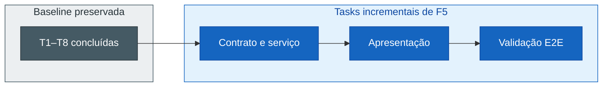

## Step 4: Tarefas — Quebre apenas o incremento em tarefas verificáveis

> A baseline já foi entregue. Recriar T1–T8, as tarefas originais de busca e clima
> atual, esconderia o delta. As novas tarefas devem mostrar somente o trabalho
> necessário para F5, a previsão diária de 7 dias.

O planejamento descreve uma cadeia de impacto. Agora você precisa transformá-la em
unidades de trabalho pequenas o bastante para implementar, revisar e validar
separadamente.

### 📖 Teoria: tarefas são contratos de execução

Uma task verificável possui ID único, dependências, superfícies afetadas,
critério objetivo de feito e critérios de aceite rastreados. Ela é pequena o
suficiente para o agente implementar e você validar antes de seguir.

Pense nas tarefas como uma sequência de estados verdes:



Cada fatia deve deixar o repositório coerente. Se uma tarefa mistura API, UI e E2E,
o diff fica mais difícil de revisar e uma falha oferece pouca informação sobre a
origem do problema.

### Objetivo

| Artefato | Por que existe |
|---|---|
| `tasks/weather-app-tasks.md` | Traduz o planejamento em incrementos verificáveis |
| Novos IDs após T8 | Preservam o histórico da baseline |
| Dependências e critérios de feito | Definem ordem e saída objetiva para cada fatia |

### ⌨️ Atividade: derive trabalho, não uma nova solução

1. Releia `intentions/7-day-forecast.md`, a spec e o plano. Use a intenção para
   verificar que as tasks ainda levam a pessoa de uma cidade selecionada ao
   planejamento dos próximos dias; use spec e plano para definir o trabalho,
   sem acrescentar escopo novo.

2. Abra `tasks/weather-app-tasks.md` e cole o bloco abaixo no final do arquivo:

   ```markdown
   ## Incremento F5: previsão diária de 7 dias

   | ID | Entrega | Depende de | Superfícies afetadas | Critério de feito | Rastreia | Estado |
   |---|---|---|---|---|---|---|
   | T9 | Contrato e serviço diário | T4, delta F5 do planejamento | `src/types/weather.ts`, `src/services/weather.ts`, `src/services/weather.test.ts` | Teste focado prova parâmetros da Open-Meteo, sete dias e o retorno diário sem regredir `current` | CA5.1, CA5.2, CA5.3 | Pendente |
   | T10 | Apresentação da previsão | T9 | `src/components/WeatherCard.tsx`, `src/components/WeatherCard.test.tsx` | Teste de componente prova sete entradas acessíveis, cada uma com máxima, mínima e condição WMO; F2 permanece verde | CA5.1, CA5.2, CA5.3 | Pendente |
   | T11 | Jornada e validação completa | T10 | `e2e/search.spec.ts`, suíte e build | E2E interceptado prova F5 após busca e seleção; lint, build e todas as suítes ficam verdes | CA5.1, CA5.2, CA5.3 | Pendente |
   ```

   Não altere T1–T8 e não delegue essa edição ao Copilot. A decomposição acima
   é usada por todos os passos de implementação seguintes.

3. Revise a decomposição:
   - Os IDs são novos e não renumeram a baseline?
   - Uma task pode ficar verde independentemente da seguinte?
   - Dependências refletem a ordem técnica?
   - O critério de feito é executável ou observável?
   - Todos os CA5 (7 dias, máxima/mínima e condição WMO) aparecem sem comportamento extra?

   Uma boa revisão também verifica o tamanho do diff esperado. Se a descrição de
   uma task exige alterar todas as camadas, divida-a antes de implementar.

4. Valide:

   ```bash
   pnpm validate:sdd tasks
   ```

5. Commit e push:

   ```bash
   git add tasks/weather-app-tasks.md
   git commit -m "step 4: derive seven-day forecast tasks"
   git push
   ```

> [!IMPORTANT]
> T1–T8 são evidência histórica, não backlog pendente. O workflow verifica que
> a baseline foi preservada e que as novas tarefas possuem metadados e
> rastreabilidade próprios.

### Checkpoint

- [ ] A baseline T1–T8, com as tarefas originais de busca e clima atual, foi preservada.
- [ ] Tasks novas cobrem contrato, UI e validação.
- [ ] Cada task possui dependência, feito e CA rastreado.
- [ ] O diff contém tarefas, não implementação.

### Em outras ferramentas

| Ferramenta | Como representa o trabalho incremental |
|---|---|
| **spec-kit** | Tasks ordenadas derivam do planejamento e podem ser executadas por fase |
| **OpenSpec** | `tasks.md` acompanha o delta e registra progresso da mudança |
| **BMAD-METHOD** | Stories e tasks conectam arquitetura a incrementos entregáveis |

<details>
<summary>Having trouble? 🤷</summary><br/>

- **As tarefas recomeçaram em T1**: preserve T1–T8, as tarefas já concluídas da
   baseline, e continue a numeração após T8.
- **`task sem dependência` ou `task sem CA`**: complete os metadados exigidos
   para cada nova task, mesmo quando a dependência for a baseline.
- **O critério de feito diz apenas “implementado”**: substitua por um resultado
   executável ou observável, como teste focado e comportamento preservado.
- **Código foi alterado**: mantenha este commit restrito a
   `tasks/weather-app-tasks.md`.
- **O workflow não iniciou**: confirme que a branch atual não é `main` e que o
   commit contém o delta de `tasks/weather-app-tasks.md`. Continue em
   `feature/7-day-forecast` para preservar o fluxo até o PR.

</details>