## Step 5: Codificação — Evolua o contrato e o serviço

> Entregue ao agente uma única task aprovada. Ele implementa a fatia; você
> controla o contexto, o escopo e a evidência.


F5 é a previsão dos próximos 7 dias. CA5.1 exige exatamente sete dias, CA5.2
exige máxima e mínima por dia e CA5.3 exige a condição WMO correspondente. Esta
fatia leva esses dados até o domínio; a interface permanece fora do escopo.

### Teoria: autoria agentica com controle humano

O agente não recebe código para reproduzir. Ele recebe o contexto que decide a
task e um limite explícito de mudança. A pessoa desenvolvedora escolhe como
interagir conforme a incerteza: use **Ask** para localizar o caminho, **Plan**
quando houver uma decisão técnica a validar e **Agent** para executar a task.
Ask e Plan são opcionais quando o contexto já é suficiente; Agent executa a
task aprovada.

```mermaid
flowchart LR
   subgraph feedforward["Feedforward"]
      A[Spec: F5 e CA5.1-CA5.3] --> B[Plan] --> C[Task aprovada]
   end
   subgraph interacao["Execução da task"]
      D[Contexto e limite] --> E[Agente implementa] --> F[Revisar diff]
   end
   subgraph evidencia["Evidência"]
      G[Teste de serviço] --> H{Verde?}
   end
   C --> D
   F --> G
   H -->|Não| I[Registrar feedback e replanejar]
   classDef planningNode fill:#1565c0,stroke:#0d47a1,color:#ffffff
   classDef buildNode fill:#6a1b9a,stroke:#4a148c,color:#ffffff
   classDef testingNode fill:#ef6c00,stroke:#e65100,color:#ffffff
   class A,B,C planningNode
   class D,E,F buildNode
   class G,H testingNode
   class I planningNode
   style feedforward fill:#e3f2fd,stroke:#1565c0,color:#0d47a1
   style interacao fill:#f3e5f5,stroke:#6a1b9a,color:#4a148c
   style evidencia fill:#fff3e0,stroke:#ef6c00,color:#e65100
```



### Objetivo

| Superfície | Resultado observável |
|---|---|
| `src/types/weather.ts` | `WeatherData` inclui os dados diários planejados |
| `src/services/weather.ts` | A chamada solicita e transporta a previsão de sete dias |
| Testes de serviço e hook | Fixture determinística prova URL, transformação e compatibilidade |

### Atividade: entregue a primeira fatia

1. Reúna o contexto que autoriza T9: `intentions/7-day-forecast.md`,
   Constituição, spec, plano, tasks e instruções locais. A decisão desta etapa
   já foi tomada: o serviço precisa obter a previsão diária; a UI e o E2E não
   devem mudar.

2. Escolha a interação que ajuda neste momento:

   | Situação | Recurso útil | Resultado esperado |
   |---|---|---|
   | Não está claro onde T9 é implementada | Ask | Arquivos mínimos, dependências e teste mais barato |
   | O agente propõe mais de uma solução técnica | Plan | Um plano curto com impacto e limites |
   | A task e o limite já estão claros | Agent | Alteração e teste focados |

3. Entregue ao agente este brief. Use-o diretamente no modo Agent ou como
   contexto para Ask ou Plan antes da execução:

   ```text
   Leia intentions/7-day-forecast.md, constitution.md,
   specs/weather-app-spec.md, plans/weather-app-plan.md,
   tasks/weather-app-tasks.md e .github/copilot-instructions.md.

   Execute T9: levar F5, a previsão diária de 7 dias, até o domínio. CA5.1
   exige sete dias; CA5.2 exige máxima e mínima por dia; CA5.3 exige condição
   WMO por dia. Preserve location e current. Limite o diff a tipos, serviço e
   testes afetados; não altere UI nem E2E. Use fixture determinística com sete
   datas, temperaturas e códigos WMO distintos. Mostre o diff e execute o teste
   de serviço mais próximo. Se a validação falhar, pare e reporte o sintoma.
   ```

4. Revise o diff: o contrato estende o clima atual? A URL solicita `daily`,
   `forecast_days=7` e `timezone=auto`? A fixture denuncia arrays desalinhados?
   UI e E2E ficaram fora da fatia?

5. Execute:

   ```bash
   pnpm test src/services/weather.test.ts
   pnpm build
   ```

6. Se algum comando ficar vermelho, registre o resultado como feedback. Use
   Plan somente se o feedback exigir uma decisão de impacto; o planning agent
   decide o delta mínimo no plano antes de qualquer nova edição. Se ficar verde,
   prossiga para o Step 6.

7. Commit e push:

   ```bash
   git add src/types/weather.ts src/services/weather.ts src/services/weather.test.ts src/hooks/useWeather.test.ts
   git commit -m "step 5: implement seven-day data contract"
   git push
   ```

### Checkpoint

- [ ] T9 recebeu feedforward e um limite claro de alteração.
- [ ] A interação escolhida resolveu uma incerteza concreta, se ela existia.
- [ ] O agente implementou apenas a fatia aprovada.
- [ ] Serviço, tipos e testes carregam os sete dias sem alterar a UI.

<details>
<summary>Having trouble? 🤷</summary><br/>

- **O agente propôs UI**: rejeite o plano e reafirme que a apresentação pertence ao Step 6.
- **O teste faz chamada de rede**: peça ao agente uma fixture no nível já usado pela suíte.
- **O clima atual deixou de compilar**: retorne ao planejamento; F5 estende `WeatherData` e preserva `location` e `current`.
- **A validação falhou**: registre o sintoma em `feedback/` e siga o Step 8; não peça correção direta sem uma decisão de planejamento.
- **O workflow não iniciou**: confirme que a branch atual não é `main` e faça o
   push em `feature/7-day-forecast`.

</details>