## Step 6: Test e Hardening — Torne a previsão observável

> O contrato diário já chega ao domínio. Agora use o agente para planejar e
> implementar a apresentação de F5 sem regredir F2, o clima atual.

F5 é a previsão dos próximos 7 dias: CA5.1 exige sete entradas; CA5.2 exige
máxima e mínima em cada entrada; CA5.3 exige a condição WMO correspondente. A
fatia termina no componente e seu teste; a jornada completa fica no Step 7.

### Teoria: o agente implementa, o teste delimita

O contrato observável orienta a solução e o teste de componente refuta
implementações que associam valores ao dia errado. Ask, Plan e Agent são meios
para obter essa solução, não etapas fixas: escolha Ask para esclarecer contratos
acessíveis, Plan para comparar alternativas de apresentação e Agent quando o
brief já descreve a task de forma suficiente.

```mermaid
flowchart LR
   subgraph contexto["Contexto aprovado"]
      A[WeatherData.daily] --> B[CA5.1: 7 dias] --> C[CA5.2: máxima e mínima] --> D[CA5.3: condição WMO]
   end
   subgraph interacao["Execução"]
      E[Brief de T10] --> F[Implementar] --> G[Revisar]
   end
   subgraph evidencia["Evidência"]
      H[WeatherCard test] --> I[Clima atual preservado]
   end
   D --> E
   G --> H
   classDef contextNode fill:#455a64,stroke:#263238,color:#ffffff
   classDef buildNode fill:#6a1b9a,stroke:#4a148c,color:#ffffff
   classDef testingNode fill:#ef6c00,stroke:#e65100,color:#ffffff
   class A,B,C,D contextNode
   class E,F,G buildNode
   class H,I testingNode
   style contexto fill:#eceff1,stroke:#455a64,color:#263238
   style interacao fill:#f3e5f5,stroke:#6a1b9a,color:#4a148c
   style evidencia fill:#fff3e0,stroke:#ef6c00,color:#e65100
```



### Objetivo

| Superfície | Resultado observável |
|---|---|
| `src/components/WeatherCard.tsx` | F5 aparece junto de F2, o clima atual |
| `src/components/WeatherCard.test.tsx` | Acessibilidade, quantidade e associação por dia são provadas |
| `src/App.tsx` | Só muda se a interface pública existente exigir |

### Atividade: entregue a segunda fatia

1. Reúna o contexto de T10: intenção, spec, plano, tasks, resultado verde de T9
   e os contratos acessíveis existentes do `WeatherCard`. Esta etapa decide como
   tornar a previsão visível, sem trocar a jornada de busca ou ampliar o E2E.

2. Use Ask caso não esteja claro qual contrato acessível preservar; use Plan
   caso existam alternativas relevantes de apresentação ou seleção de teste. Se
   isso já estiver claro no código e no plano, vá diretamente ao Agent.

3. Dê ao agente um brief de execução:

   ```text
   Execute T10: apresente F5 no WeatherCard a partir da intenção e do plano.
   Preserve F2: temperatura, sensação térmica, condição, vento e umidade. Crie
   uma região acessível para a previsão com exatamente sete entradas; cada uma
   deve apresentar data, máxima, mínima e condição WMO. Atualize os testes de
   componente com fixture determinística e dados distintos para provar CA5.1,
   CA5.2 e CA5.3. Não altere E2E; altere App.tsx apenas se o contrato existente
   exigir. Mostre o diff e execute primeiro o teste do componente. Pare e
   reporte qualquer falha.
   ```

4. Revise: a região de clima atual continua presente? A previsão pode ser
   localizada por papel e nome acessível? Cada entrada liga valores do mesmo
   índice? A fixture distingue os dias? O E2E ficou para o Step 7?

5. Execute:

   ```bash
   pnpm test src/components/WeatherCard.test.tsx
   pnpm test
   pnpm build
   ```

6. Vermelho é feedback: registre o sintoma e volte ao planejamento somente se
   ele exigir uma decisão nova antes de outra implementação. Verde libera o E2E.

7. Commit e push:

   ```bash
   git add src/components/WeatherCard.tsx src/components/WeatherCard.test.tsx src/App.tsx
   git commit -m "step 6: present seven-day forecast"
   git push
   ```

### Checkpoint

- [ ] T10 recebeu o contexto e os limites de apresentação corretos.
- [ ] Cada CA5 possui uma asserção de componente observável.
- [ ] O agente alterou somente a fatia de apresentação aprovada.
- [ ] F2 e F5 passam nos testes de componente.

<details>
<summary>Having trouble? 🤷</summary><br/>

- **O teste usa classes CSS como seletor**: use papel, nome acessível ou texto contratual.
- **A contagem encontra mais de sete elementos**: o plano deve escopar a busca à região da previsão diária.
- **Datas ou temperaturas trocaram de lugar**: use dados distintos por dia para tornar o erro diagnosticável.
- **F2 regrediu**: registre a falha e retorne ao planejamento antes da correção.
- **O workflow não iniciou**: confirme que a branch atual não é `main` e faça o
   push em `feature/7-day-forecast`.

</details>