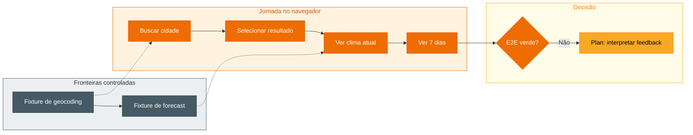

## Step 7: E2E — Valide a previsão de 7 dias

> Serviço e componente verdes não provam a jornada real. Planeje com o agente
> um cenário E2E determinístico e faça-o implementar apenas esse cenário.

F5 é a previsão diária dos próximos 7 dias. CA5.1 prova a quantidade após a
seleção de uma cidade; CA5.2 prova máxima e mínima por dia; CA5.3 prova a
condição WMO correspondente. A API externa é uma fronteira controlada por
fixtures, não uma dependência da internet.

### Teoria: determinismo sem receita de código

Determinístico significa cenário e dados estáveis, não código pré-escrito. O
brief fixa as fronteiras e evidências; o agente segue o estilo do Playwright já
existente. Use Ask para localizar esse estilo ou Plan para avaliar a estratégia
de interceptação apenas quando isso ainda não estiver claro.



### Objetivo

| Superfície | Resultado observável |
|---|---|
| `e2e/search.spec.ts` | Busca, seleção, clima atual e F5 funcionam no browser |
| Fixtures interceptadas | Datas, temperaturas e condições WMO são reproduzíveis |
| Seletores acessíveis | O teste prova contrato de interface, não CSS |

### Atividade: entregue a jornada completa

1. Reúna o contexto de T11: intenção, spec, plano, tasks, E2E existente e os
   resultados verdes de T9 e T10. A tarefa é provar a jornada após buscar e
   selecionar uma cidade; não é redesenhar o serviço ou o componente.

2. Use Ask se precisar localizar rotas e seletores no teste existente. Use Plan
   apenas se a estratégia de fixture ou interceptação admitir mais de uma opção.
   Caso contrário, execute diretamente com Agent.

3. Dê ao agente o brief abaixo:

   ```text
   Execute T11: implemente um teste E2E determinístico para F5. A jornada deve buscar uma cidade
   e selecionar um resultado antes de exibir a previsão. Intercepte geocoding e
   forecast antes de page.goto. Use sete datas, máximas, mínimas e códigos WMO
   distintos. O cenário deve provar CA5.1 (sete entradas), CA5.2 (máxima e
   mínima por entrada) e CA5.3 (condição WMO por entrada), preservando os
   cenários baseline de busca, loading e erros. Não use rede real. Mostre o
   diff, execute o E2E e pare para reportar o sintoma se houver falha.
   ```

4. Revise: as rotas são registradas antes de `page.goto`? O teste percorre busca
   e seleção? A previsão contém sete entradas no escopo correto? Cada entrada
   comprova máxima, mínima e condição WMO? Nenhuma chamada depende da internet?

5. Execute:

   ```bash
   pnpm test:e2e
   ```

6. Se ficar vermelho, não solicite uma tentativa de correção direta. Registre o
   feedback e volte ao planejamento, conforme o Step 8. Se ficar verde, a
   fatia vertical está pronta para a validação completa.

7. Commit e push:

   ```bash
   git add e2e/search.spec.ts
   git commit -m "step 7: verify seven-day forecast end to end"
   git push
   ```

### Checkpoint

- [ ] T11 recebeu contexto, fronteiras e evidências explícitas.
- [ ] A interação escolhida resolveu uma incerteza real, se ela existia.
- [ ] O agente implementou uma jornada sem rede real.
- [ ] O E2E preserva a baseline e prova F5 de ponta a ponta.

<details>
<summary>Having trouble? 🤷</summary><br/>

- **O teste é intermitente**: confira as fronteiras interceptadas antes da navegação.
- **A contagem inclui elementos extras**: escopo a asserção à região acessível da previsão diária.
- **O teste passa com valores desalinhados**: use dados distintos e asserções por entrada.
- **O Playwright não encontra navegador**: execute `pnpm exec playwright install chromium` e revalide o cenário.
- **O workflow não iniciou**: confirme que a branch atual não é `main` e faça o
   push em `feature/7-day-forecast`.

</details>