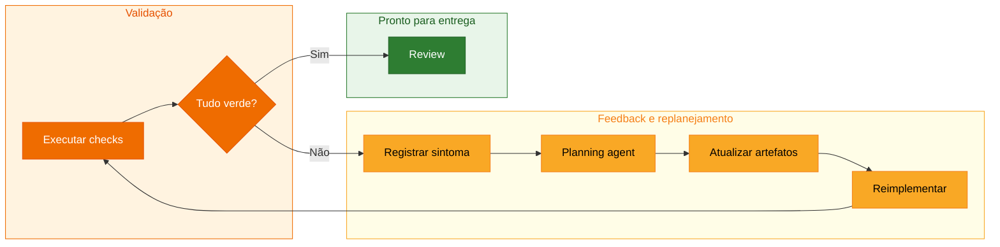

## Step 8: Handoff de Feedback — Replaneje o feedback até tudo ficar verde

> Agora execute todas as validações. O resultado decide o próximo caminho, mas
> qualquer caminho vermelho entra novamente pelo planejamento.


Uma primeira implementação pode passar ou falhar. O aprendizado deste step não
depende de fabricar um defeito: ele está em tratar o resultado como evidência e
tomar a próxima decisão de forma rastreável.

### 📖 Teoria: feedback é entrada de planejamento

O loop não é “teste falhou, edite até passar”. É uma decisão rastreável:



Não fabrique uma falha. Se tudo passar na primeira execução, registre uma
iteração verde e siga. Se houver vermelho, o log deve mostrar a volta ao Plan.

Existem dois caminhos legítimos:

| Resultado | Próxima ação |
|---|---|
| Tudo verde | Registrar evidências e preparar o review |
| Alguma validação vermelha | Registrar sintoma, replanejar, atualizar derivados e revalidar |

> [!CAUTION]
> Não transforme uma mensagem de teste em instrução de implementação. Primeiro
> descubra se o problema está na spec, no plano, na task, no código ou no próprio
> teste.

### Objetivo

| Artefato | Por que existe |
|---|---|
| `feedback/7-day-forecast-loop.md` | Preserva comandos, resultados e decisões da iteração |
| `plans/weather-app-plan.md` | Recebe primeiro qualquer decisão causada por feedback vermelho |
| Revalidação completa | Demonstra que o loop terminou em um estado coerente |

### ⌨️ Atividade: execute e registre o loop real

1. Execute a validação do produto:

   ```bash
   pnpm lint
   pnpm build
   pnpm test
   pnpm test:e2e
   ```

2. No Explorer do VS Code, crie `feedback/7-day-forecast-loop.md` e cole o
   template abaixo. Substitua todos os valores entre `<...>` pelas evidências da
   sua execução; não registre um estado verde se o comando ficou vermelho:

   ```markdown
   # Loop de feedback: previsão de 7 dias

   ## Comandos e estados

   | Comando | Estado |
   |---|---|
   | `pnpm lint` | `<verde ou vermelho>` |
   | `pnpm build` | `<verde ou vermelho>` |
   | `pnpm test` | `<verde ou vermelho>` |
   | `pnpm test:e2e` | `<verde ou vermelho>` |

   ## Evidências

   - `<resumo verificável da saída de lint e build>`
   - `<quantidade de testes Vitest aprovados ou mensagem da falha>`
   - `<quantidade de testes Playwright aprovados ou mensagem da falha>`

   ## Critérios afetados

   `<CA5.1, CA5.2, CA5.3 ou nenhum; explique a relação com eventual falha>`

   ## Decisão de planejamento

   `<seguir sem mudança porque tudo passou, ou registrar o diagnóstico e o
   ajuste mínimo que precisa entrar primeiro no Plan>`

   ## Artefatos alterados

   `<nenhum, ou paths alterados após o replanejamento>`

   ## Resultado da revalidação

   `<comandos repetidos, estados finais e evidência de que o loop terminou>`
   ```

   Não delegue o preenchimento ao Copilot: o registro deve refletir os comandos
   que você realmente executou.

3. Se houver vermelho, entregue ao planning agent o feedback junto de
   `intentions/7-day-forecast.md`, spec, plano e tasks. A intenção permanece a
   fonte do resultado desejado; o feedback é evidência observada e não a
   substitui. Depois, abra `plans/weather-app-plan.md` e acrescente uma seção
   `## Iteração por feedback` contendo: comando e sintoma, hipótese, decisão
   mínima, artefatos derivados que precisam mudar e revalidação esperada.
   Atualize Spec e Tasks somente quando a decisão alterar contrato ou trabalho.
   Preserve IDs e só então corrija a implementação.

4. Valide o próprio registro e a cadeia de rastreabilidade:

   ```bash
   pnpm validate:sdd feedback
   pnpm validate:sdd full
   ```

   Se um desses comandos ficar vermelho, acrescente o resultado ao feedback e
   aplique a mesma regra de replanejamento.

5. Repita até ficar verde. Cada volta recebe uma nova seção no log.

6. Commit e push de tudo que o loop tocou:

   ```bash
   git add feedback/ specs/ plans/ tasks/ src/ e2e/
   git commit -m "step 8: close seven-day forecast feedback loop"
   git push
   ```

> [!IMPORTANT]
> Se tudo estiver verde na primeira tentativa, isso não é um atalho nem uma
> falha do exercício. Registre a iteração verde; não introduza um defeito
> artificial apenas para percorrer o caminho vermelho.

### Checkpoint

- [ ] O log registra uma validação real, mesmo que verde na primeira tentativa.
- [ ] Qualquer vermelho voltou ao Plan antes da implementação.
- [ ] Toda a suíte e a rastreabilidade estão verdes.
- [ ] Não existe correção sem decisão registrada no Plan.

### Em outras ferramentas

| Ferramenta | Como trata feedback |
|---|---|
| **spec-kit** | Clarificações e novo planejamento atualizam os artefatos antes da implementação |
| **OpenSpec** | O delta permanece aberto e evolui até passar pela validação |
| **BMAD-METHOD** | Feedback de validação retorna à story e aos artefatos de planejamento |

<details>
<summary>Having trouble? 🤷</summary><br/>

- **Tudo passou de primeira**: registre os comandos, resultados e a decisão de
   seguir para review.
- **Um teste falhou**: copie o sintoma para o log, associe o CA afetado e
   registre a decisão no Plan antes de alterar código.
- **O plano não precisou mudar**: registre explicitamente a análise e a decisão;
   feedback não exige mudança artificial, mas exige raciocínio visível.
- **`validate:sdd full` falhou**: use a âncora indicada para localizar a quebra
   entre spec, plano, tasks e evidência de teste.
- **O workflow não iniciou**: confirme que a branch atual não é `main` e que o
   commit contém `feedback/7-day-forecast-loop.md`. Continue em
   `feature/7-day-forecast` para preservar o fluxo até o PR.

</details>