## Step 9: Revisão + Integração — Revise o delta e abra o PR

> O PR é a demonstração final: não apenas código novo, mas a intenção propagada
> por todos os artefatos SDD.

O incremento está verde. Antes do merge, você fará uma última leitura da mudança
na mesma ordem em que ela aconteceu, procurando lacunas entre promessa e
evidência.

### 📖 Teoria: review guiado por spec

Review guiado por spec compara o delta com `main`. A pergunta não é “o código
parece bom?”, mas “cada promessa nova está planejada, implementada e provada sem
regredir as promessas anteriores?”.

```mermaid
flowchart LR
   subgraph contrato["Intenção e contrato"]
      direction LR
      A[Pedido] --> B[F5 + CA5.1–CA5.3]
   end

   subgraph planejamento["Planejamento"]
      direction LR
      C[Plan] --> D[Tasks]
   end

   subgraph construcao["Construção"]
      E[Codificação]
   end

   subgraph evidencia["Evidência"]
      F[Tests]
   end

   subgraph entrega["Entrega"]
      direction LR
      G[Review] --> H[PR]
   end

   B --> C
   D --> E --> F --> G

   classDef planningNode fill:#1565c0,stroke:#0d47a1,color:#ffffff
   classDef buildNode fill:#6a1b9a,stroke:#4a148c,color:#ffffff
   classDef testingNode fill:#ef6c00,stroke:#e65100,color:#ffffff
   classDef releaseNode fill:#2e7d32,stroke:#1b5e20,color:#ffffff

   class A,B,C,D planningNode
   class E buildNode
   class F testingNode
   class G,H releaseNode

   style contrato fill:#e3f2fd,stroke:#1565c0,color:#0d47a1
   style planejamento fill:#e3f2fd,stroke:#1565c0,color:#0d47a1
   style construcao fill:#f3e5f5,stroke:#6a1b9a,color:#4a148c
   style evidencia fill:#fff3e0,stroke:#ef6c00,color:#e65100
   style entrega fill:#e8f5e9,stroke:#2e7d32,color:#1b5e20
```



Uma matriz de rastreabilidade torna ausências visíveis. Uma linha sem evidência
é um achado; muitos arquivos sem âncora podem indicar escopo não planejado.

### Objetivo

| Artefato | Por que existe |
|---|---|
| `review/7-day-forecast.md` | Liga cada âncora a evidências reais e registra achados |
| Pull Request para `main` | Expõe o antes e depois como uma história revisável |
| SDD Guard | Reexecuta qualidade e rastreabilidade antes do merge |

### ⌨️ Atividade: revise a cadeia inteira

1. No Explorer do VS Code, crie `review/7-day-forecast.md` e cole o template
   abaixo. Substitua `<status>` e `<achado ou nenhum>` após inspecionar o diff de
   `feature/7-day-forecast` contra `main`:

   ```markdown
   # Review: previsão de 7 dias

   ## Achados

   - `<achado relevante com severidade e path, ou "Nenhum achado bloqueante">`

   ## Matriz de rastreabilidade

   | Âncora | Planejamento | Implementação e evidência | Status |
   |---|---|---|---|
   | Intenção: selecionar cidade e ver 7 dias | `intentions/7-day-forecast.md` | `specs/weather-app-spec.md` | `<status>` |
   | CA5.1: exatamente 7 dias | `plans/weather-app-plan.md`, T9–T11 | `src/services/weather.test.ts`, `src/components/WeatherCard.test.tsx`, `e2e/search.spec.ts` | `<status>` |
   | CA5.2: máxima e mínima por dia | `plans/weather-app-plan.md`, T9–T11 | `src/services/weather.ts`, `src/components/WeatherCard.tsx` e testes F5 | `<status>` |
   | CA5.3: condição WMO por dia | `plans/weather-app-plan.md`, T9–T11 | `src/components/WeatherCard.tsx` e testes F5 | `<status>` |
   | F1–F4 preservadas | Baseline da spec e T1–T8 | Testes baseline unitários, de componente e E2E | `<status>` |
   | Loop de validação | Regra de replanejamento | `feedback/7-day-forecast-loop.md` | `<status>` |

   ## Resumo

   `<declare se a mudança está pronta para PR, quais validações passaram e quais
   riscos residuais permanecem>`
   ```

   Não delegue a inspeção ao Copilot. Cada status precisa apontar para evidência
   que você verificou no diff, nos testes ou no feedback.

2. Resolva achados relevantes pelo mesmo loop. Depois execute novamente:

   ```bash
   pnpm lint
   pnpm build
   pnpm test
   pnpm test:e2e
   pnpm validate:sdd review
   pnpm validate:sdd full
   ```

3. Commit e push do review:

   ```bash
   git add review/7-day-forecast.md
   git commit -m "step 9: review seven-day forecast traceability"
   git push
   ```

4. Abra o Pull Request:

   ```bash
   gh pr create --base main --head feature/7-day-forecast --title "Weather App: previsão de 7 dias" --fill
   ```

   O push publica a evidência, mas o Step 9 só é validado quando o Pull Request
   para `main` é aberto. Isso garante que o exercício não termine antes da
   entrega existir.

5. No PR, abra **Files changed** e percorra a história na ordem: intenção,
   Constituição, spec, plano, tasks, código, testes e feedback de validação.
   Verifique como esses artefatos formaram e atualizaram o feedforward. Aguarde o SDD
   Guard ficar verde antes do merge.

> [!TIP]
> Um bom PR de SDD pode ser revisado em duas direções: do pedido até o teste e de
> uma linha de código de volta ao critério que a justifica.

### Checkpoint

- [ ] A matriz de review aponta para evidências reais.
- [ ] O PR mostra claramente a baseline e o delta F5, a previsão diária de 7 dias.
- [ ] SDD Guard, testes e rastreabilidade passam.
- [ ] O merge em `main` dispara o deploy existente.

### Em outras ferramentas

| Ferramenta | Como encerra a mudança |
|---|---|
| **spec-kit** | Implementação e checklist sustentam o review contra a spec |
| **OpenSpec** | A change validada pode ser arquivada após a entrega |
| **BMAD-METHOD** | Review e retrospectiva fecham a story com evidências |

<details>
<summary>Having trouble? 🤷</summary><br/>

- **O review aponta uma lacuna**: trate-a pelo loop do Step 8; não edite
   diretamente só para satisfazer a matriz.
- **`gh pr create` pede autenticação**: execute `gh auth status` e conclua a
   autenticação do GitHub CLI.
- **A branch do PR não foi encontrada**: execute `git branch --show-current` e
   confirme `feature/7-day-forecast`; depois publique-a com
   `git push -u origin feature/7-day-forecast` antes de criar o PR.
- **O SDD Guard está vermelho**: abra o job, registre o comando que falhou e
   retorne ao Plan quando houver impacto no comportamento ou no planejamento.
- **O deploy não iniciou**: confirme que o PR foi mesclado em `main` e consulte a
   aba Actions.

</details>