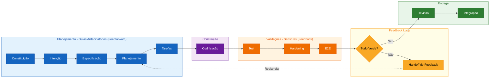

# Spec-Driven Development: Construindo com Intenção

_Aprenda a metodologia Spec-Driven Development (SDD) evoluindo um Weather App
real, do pedido à entrega._

## Bem-vindo(a)

- **Para quem é este exercício**: Desenvolvedores que querem estruturar melhor o
    processo de desenvolvimento com IA, passando de "código primeiro" para "spec
    primeiro"
- **O que você vai aprender**:
    - A metodologia SDD de ponta a ponta, do pedido à entrega (fluxo completo no
        diagrama abaixo)
    - Como evoluir uma especificação viva com critérios de aceite testáveis e IDs
        estáveis
    - Como reconhecer esses conceitos em ferramentas reais de SDD ([spec-kit](https://github.com/github/spec-kit), [OpenSpec](https://github.com/Fission-AI/OpenSpec), [BMAD-METHOD](https://github.com/bmad-code-org/BMAD-METHOD))
- **O que você vai construir**: A previsão dos próximos 7 dias em um Weather App
    funcional feito com React + TypeScript + Vite e Open-Meteo (sem API key)
- **Pré-requisitos**:
    - Conhecimento básico de Git e GitHub
    - Familiaridade com TypeScript/React (nível iniciante é suficiente)
    - Node.js 20 e pnpm 10
    - Conta no GitHub com acesso ao GitHub Copilot (recomendado)

- **Duração**: Este exercício leva **de 60 a 90 minutos** para ser concluído.

O repositório já contém o produto funcional, sua spec, plano, tasks, testes e
CI. No Harness, intenção, Constituição, spec, plano, tasks e instruções fornecem
feedforward antes de cada execução; testes, CI e review funcionam como sensores
que produzem feedback. A branch `main` é o **antes**, com F1–F4 e clima atual; a
branch `feature/7-day-forecast` será o **depois**, com F5 rastreada do novo
pedido ao teste E2E.

## Visão geral: o fluxo SDD

> **O princípio que costura o fluxo**: cada etapa deriva da especificação — o plano a
> detalha, as tarefas a fatiam, o código a executa e os testes a verificam. Se um
> comportamento não está na especificação, ele não entra no código; se é um critério de
> aceite, existe um teste que o prova.

A [Constituição](constitution.md) governa o fluxo inteiro. O pedido inicial é
registrado em `intentions/7-day-forecast.md`; essa intenção é a fonte inicial do
Spec-Driven Development (SDD) e compõe o **feedforward** junto com constituição, especificação, planejamento, tarefas e
instruções. **Feedback** fica reservado aos resultados produzidos pelos sensores
após execução ou validação e é registrado em `feedback/`.

Quando uma validação fica vermelha, o feedback volta ao **Planejamento**. O planning
agent diagnostica o impacto e coordena a próxima iteração antes de novas
mudanças em tasks ou código.

## Neste exercício, você irá:

As etapas do diagrama acontecem em **9 steps práticos**. Alguns steps agrupam
duas etapas vizinhas para evoluir uma parte real do Weather App:

1. **Intenção** — executar a baseline e registrar deterministicamente a intenção
    que orientará a spec, sem começar pelo código
2. **Especificação** — evoluir a especificação existente com F5 e critérios de aceite
    testáveis
3. **Planejamento** — analisar o impacto da spec em dados, API, UI e estratégia de testes
4. **Tarefas** — quebrar apenas o incremento em tarefas verificáveis rastreadas à
    spec
5. **Codificação** — evoluir o contrato e o serviço com o agente, guiados pela
    intenção, spec e tasks
6. **Test e Hardening** — tornar a UI observável e verificar cada camada,
    cobrindo os edge cases da spec
7. **E2E** — validar F5 pela perspectiva do usuário com fixtures determinísticas
8. **Handoff de Feedback** — rodar o loop de feedback (validar → registrar → replanejar →
    reimplementar) até tudo ficar verde
9. **Revisão + Integração** — fazer a revisão rastreável do delta e integrar o PR

### Como iniciar o exercício

Copie o exercício para sua conta, aguarde **cerca de 20 segundos** para a Mona
preparar a primeira lição e depois **atualize a página**.

Problemas para começar?
 

Ao copiar o exercício, recomendamos as seguintes configurações:

- Para owner, escolha sua conta pessoal ou uma organização.
- Recomendamos criar um repositório público, pois repositórios privados consomem
    minutos de Actions.

Se o exercício não estiver pronto em 20 segundos, verifique a aba [Actions](../../actions).

- Verifique se há um job em execução. Às vezes demora um pouco mais.
- Se a página mostrar um job com falha, abra uma issue. Você encontrou um bug!

