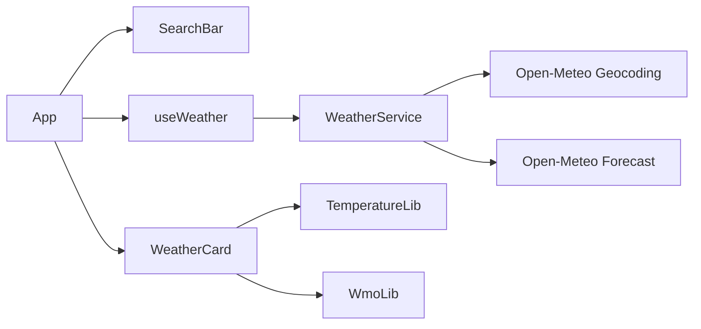

# Plano Técnico: Weather App

## Baseline

Este plano implementa a versão 1.0 da spec. Mudanças futuras devem atualizar
este documento por análise de impacto antes de alterar tasks ou código.

## Arquitetura

## Modelo de dados

- `Location`: identidade, nome, coordenadas, país e região opcional.
- `WeatherData.location`: localização selecionada.
- `WeatherData.current`: temperatura, sensação, código WMO, vento e umidade.
- `AsyncState<T>`: estados `idle`, `loading`, `success` e `error`.

O modelo da baseline não contém dados diários.

## Integrações

| Operação | Endpoint | Parâmetros relevantes |
|---|---|---|
| Buscar cidades | `geocoding-api.open-meteo.com/v1/search` | `name`, `count=5`, `language=pt`, `format=json` |
| Consultar clima | `api.open-meteo.com/v1/forecast` | `latitude`, `longitude`, `current`, `timezone=auto` |

## Decisões

| Decisão | Escolha | Motivo |
|---|---|---|
| Estado assíncrono | Hook local com union type | O fluxo é pequeno e não exige store global |
| Acesso externo | Serviço isolado | Mantém fetch e parâmetros fora da UI |
| Condições | Funções puras WMO | Facilita teste e fallback |
| E2E | Rotas interceptadas | Elimina dependência da rede real |

## Estratégia de testes

| Critérios | Nível | Evidência |
|---|---|---|
| CA1.1–CA1.4 | Serviço, hook, componente e E2E | `src/services/weather.test.ts`, `src/hooks/useWeather.test.ts`, `src/components/SearchBar.test.tsx`, `e2e/search.spec.ts` |
| CA2.1–CA2.6 | Serviço, hook, componente e E2E | `src/services/weather.test.ts`, `src/hooks/useWeather.test.ts`, `src/components/WeatherCard.test.tsx`, `e2e/search.spec.ts` |
| CA3.1–CA3.4 | Unitário | `src/lib/temperature.test.ts` |
| CA4.1–CA4.3 | Unitário e componente | `src/lib/wmo.test.ts`, `src/components/WeatherCard.test.tsx` |

## Regra de replanejamento

Validação vermelha produz feedback para o planning agent. O agente atualiza
primeiro este plano e coordena os deltas derivados antes de nova implementação.